# Peatavad koerad

### Lääne-siberi laika
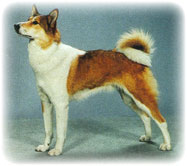{ style="float:right;"}

Lääne siberi laika on aretatud hantide ja manside tõututest jahilaikadest. Koer on keskmist ja üle keskmise kasvu, tugevkuiva kehaehitusega. Iseloomult on ta tasakaalukas, liikuv, hea
orienteerumisvõimega. Inimeste vastu ei ole kuri, kuid mõnedel koertel esineb väga tugev kaitserefleks.

Tüüpiline liikumisviis uluki otsimisel ja jälitamisel on lai kiire traav vaheldumisi galopiga. Turja kõrgus isastel 54...60cm, emastel 2cm madalam. Karvkatte värvus on valge, hundihall, laiguline, ruuge, hallikas, kõigis toonides beez või mustjaspruun.

### Vene-euroopa laika
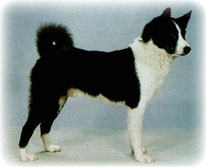{ style="float:right;"}

Vene euroopa laika on aretatud Komi ja Udmurdi ning Arhangelski oblasti tõututest jahilaikadest. Iseloomult on vene euroopa laika tasakaalukas, elav, hästi arenenud orienteerumisvõimega. Inimeste vastu ei ole kuri.

Tüüpiline liikumisviis uluki otsimisel ja jälitamisel on traaviga
vahelduv galopp. Turja kõrgus on isastel 52...58cm, emastel 2cm madalam.
Karvkatte värvus võib olla üleni must, valge, hallikaspunane, hundihall või musta valgekirju. Viimane värvus on kõige eelistatum.

### Ida-siberi laika

Ida siberi laika on aretatud evengi ja teistest Ida-siberi kohalikest tõututest jahilaikadest. Teda aretatakse ajutise tõustandardi järgi.
Tõug on levinud Jenissei jõest ida poole kuni Zeja jõeni. Ida siberi laika on väga tugeva jahiinstinktiga. Turja kõrgus on isastel 55...64cm, emastel 2cm madalam. Karvkatte värvus on hundihall, valge, hall, must, ruuge või kõigis toonides pruun, täpiline või laiguline.

### Soome püstkõrv
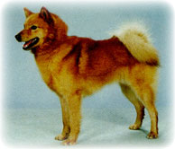{ style="float:right;"}

Soome püstkõrv on aretatud Soome ja Karjala kohalikest tõututest lindu haukuvatest püstkõrvalistest jahikoertest. Esimene tõustandard kinnitati 1892. Iseloomult on ta julge, iseseisev , sõltumatu. Seda koera ei saa alistada ega sundida kuulekusele.

Soome püstkõrv on väga energiline ja liikuv koer, kes ei suuda kaua ühe koha peal paigal püsida. Ideaalkõrguseks loetakse isastel 44...47cm, emastel 40...43cm. Tegemist on väikest kasvu, kehaehituselt ruutja, väga tugeva jahiinstinktiga koeraga. Karvkatte värvus on punane (kollakaspunasest kuni punakaspruunini).

### Karjala karukoer
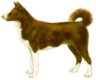{ style="float:right;"}

Ka karjala karukoera juured ulatuvad Komimaale. Kogu hilisema aretustöö aluseks on Karjalas olnud tõutute, erivärviliste, püstkõrvaliste jahikoerte populatsioon. Aretustöö algas 1930. ja tõustandard kinnitati 1945. Karjala karukoer on keskmise suurusega, arenenud luustikuga ja lihaseline.

Iseloomult on karjala karukoer tasakaalukas, veidi umbusklik, tugeva iseloomiga. Eriti hästi on arenenud haistmine. Kasutatakse karu ja põdra küttimisel. Ideaalkõrgus on isastel 57cm, emastel 52cm. Kõikumine on lubatud pluss-miinus 3cm. Karvkatte värvus on kas must või must-valge. Esineb ka nudi saba.

### Jämtlandi koer
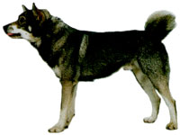{ style="float:right;"}

Jämtlandi koer aretati Rootsi kohalikest püstkõrvalistest jahikoertest. Tõustandart kinnitati 1946. Kuigi tõustandard kinnitati suhteliselt hilja, on siiski tegemist ühe väga vana jahikoeratõuga.

Jämtlandi koer on võimas, tugeva ja kuiva kehaehitusega koer. Iseloomult tasakaalukas koer. Kasutatakse põdra, karu ja ilvese jahil. Mõned koerad hauguvad ka puu otsas olevat lindu. Kõrgus isastel 57...65cm, emastel 52...60cm. Karvkatte värvus helehallist tumehallini. Iseloomulikud on valkjad või kollakad laigud koonul, põskedel ja kurgu all.

### Norra hall põdrakoer
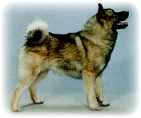{ style="float:right;"}

Norra hall põdrakoer on aretatud Norra kohalikest erineva välimusega püstkõrvalistest põtra haukuvatest koertest. Ühtse välimusega koerte populatsioon oli välja kujunenud 1946-ndaks aastaks.

Norra hall põdrakoer on tüüpiline püstkõrvaline tugeva, ruutja
kehaehitusega jahikoeratõug. Iseloomult on julge, tarmukas ja kartmatu. Kasutatakse ainult põdrajahil. Isaste ideaalkõrgus on 52cm, emastel 49cm. Karvastiku värvus on kõikides toonides hall.

# Ajavad koerad

## Linnukoerad

### Saksa karmikarvaline linnukoer
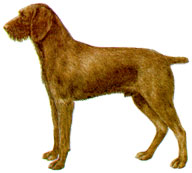{ style="float:right;"}

Üks vanimaid jahikoeratõuge. Sellist tüüpi koeri on kirjeldanud juba roomlased vanadel germaanlastel. Selle tõu aretuses on kasutatud hagijaid ja ka prantsuse ja itaalia linnukoeri. See koer on aretatud Saksamaal. Lõplikult kujunes tõug välja 20 saj. algul.

Koer on üle keskmise kasvu, tugevkuiva kehaehitusega. Sellel tõul on väga tugev kaitserefleks. Turja kõrgus isastel 60...68 cm, emastel 56..64 cm. Karmikarvalisele linnukoerale on iseloomulik habe, vuntsid ning karvapuhmad kulmudel ja ninajuurel. Keha katva karva pikkuseks on 3..6 cm. Karv on karm. Kõht on karvane. Karvkatte värvused on üleni kohvipruun, kohvipruun hõbehallil põhjal, kohvipruuni laiguline või täpiline, kohvipruun halli kirmega ja väga harva üleni hõbehall. Esineb ka musti koeri.

### Saksa lühikarvaline linnukoer
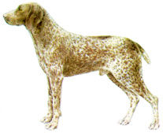{ style="float:right;"}

Saksa lühikarvaline linnukoer on aretatud Saksamaal. Aretuses on
kasutatud nii kohalikke kui ka prantsuse ja itaalia linnukoeri ning vähesel määral ka pointerit. Löplikult kujunes tõug välja 19. saj. löpuks. Koer on kõrge eeskehaga, proportsionaalse tugevkuiva kehaehitusega, tasakaaluka iseloomuga, väga liikuv.

Turja kõrgus isastel 62...66 cm, emastel 58...64 cm. Keha kattev karv on 1,5...2 cm pikk, tihe, sirge, läikiv. Karvkatte värvus on
kohvipruunilaiguline või täpiline, kohvipruun halli kirmega või üleni kohvipruun. Esineb ka musti koeri.

### Saksa pikakarvaline linnukoer
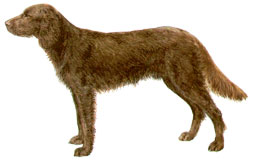{ style="float:right;"}

Saksa pikakarvaline linnukoer sarnaneb välimuse poolest teistele saksa linnukoertele. Turja kõrgus on isastel 62 -- 67 cm ,emastel 58 -- 64 cm.
Keha katab pikk, tihe, karedavõitu laineline karv. Kaelal, rinnal ja kõhul on karva pikkus 6 -- 10 cm, seljal ja külgedel 3 -- 5 cm. Jalgade tagakülgedel on karv pikem ja rippuv. Saba alapoolel moodustab kuni 15 cm pikkune karv nn. lipu. Saba ei kupeerita ja see ulatub kandadeni.

### Pointer
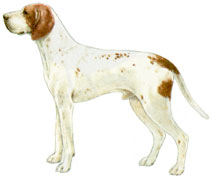{ style="float:right;"}

Pointer on aretatud Inglismaal 18. sajandil. Aretusmaterjaliks olid hispaania ja itaalia päritoluga lühikarvalised koerad, kes jäid linnu ees seisma. Pointer on lühikarvaline, tugevkuiva kehaehitusega, julge, elav ja energiline linnukoer.Tüüpiline liikumisviis jahil on kiire, energiline galopp.

Flegmaatilisust loetakse puuduseks, kurjust inimese vastu või argust veaks. Luustik on tugev, lihased hästi arenenud, reljeefsed. Turja kõrgus on isastel 57...65 cm, emastel 54...63 cm. Pointeri karvkatte värvus on punase, kollase, pruuni või mustalaiguline. Esineb ka üleni ühevärviline karvkate must, kohvipruun või mitmesugustes toonides beez.

### Iiri setter
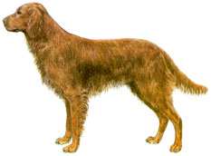{ style="float:right;"}

Iiri setter on aretatud Iirimaal 17. sajandil, kuid kaasaegne karvkatte värvus kujunes lõplikult välja 19. sajandi teisel poolel. Esimene iiri setteri standard koostati 1885. a. Dublinis sealse punaste setterite kasvatajate klubi poolt. Iiri setter on keskmist kasvu, proportsionaalse, kuivtugeva kehaehitusega, kõrge eeskehaga koer.

Ta on liikuv ja energiline. Saaklooma otsib kiirel galopil. Linnu ees seisab ta püsti ja ei lama. Turja kõrgus on isastel 57-66 cm, emastel 3 cm madalam. Luustik ja lihased on hästi arenenud. Värvus on ühetooniline tume-punakasruuge (meenutab poleeritud punase puu värvi), ilukarv võib olla veidi heledam. Tänapäeval esineb ka punavalgeid eksemplare.

### Gordoni setter
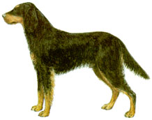{ style="float:right;"}

Gordoni setter on aretatud Sotimaal. Lähtematerjaliks olid vanad inglise mustad kõrbpiirdega linnukoerad, kellele lisati hispaania brakkide ja pruunide veespanjelite verd. Tõu standard töötati välja Gordon Clubi poolt 1891. a. Kaasaegses Gordoni setteris on säilinud massiivne luustik ja kehaline võimsus, kuid koerad on muutunud kiiremakäiguliseks. Koer on rahulik, tasakaalukas, pehme iseloomuga ja kuulekas.

Gordoni setter on üle keskmise kasvu, kõrge eeskehaga, massiivse
luustikuga ja hästi arenenud lihastikuga. Turja kõrgus on isastel 63-69 cm, emastel 4 cm madalam. Värvus on must sinkja helgiga (meenutab ronga tiiva värvust), selgelt piiritletud eredate roostepunaste piiretega, mis paiknevad kulmudel, kõrvade sisekülgedel, koonul põsenukkide all ja alumisel lõual, mokkadel, rinnal kahe ülemiste tippudega ühinenud kolmnurgana. Piire on ka ees- ja tagajalgadel ning päraku piirkonnas ja saba alumisel poolel. On lubatud vähesed valged karvad varvastel.

### Inglise setter
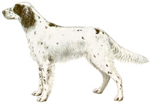{ style="float:right;"}

Inglise setter on aretatud Inglismaal 19. sajandi esimesel poolel seal tollal kasutusel olnud tüübilt erinevatest täpilistest ja laigulistest setteritest. Inglise setteri aretuslugu on tihedalt seotud tõu esimese aretaja Edward Laveracki (1789-1877) nimega. Ligi 50-aastase töö tulemusena aretas Laverack setteri tüübi, keda õigustatult nimetatakse laverack-setteriks.

Inglise setter on kuivtugeva kehaehitusega, energiliste liigutuste ja elegantse välimusega koer. Inimeste vastu on ta leebe ja heatahtlik. Koer on keskmist kasvu. Turja kõrgus isastel 56-64 cm, emastel 53-62 cm.
Luustik ja lihastik on hästi arenenud. Nahk on tihe, õhuke, elastne, ilma voltideta. Värvus -- kahevärviline, valgel põhjal on mustad, kollased, oranzpunased või pruunid täpid ja laigud.
Kolmevärviline-mustade täppide ja laikudega koeral on koonul,
kulmukaartel, kõrvade sisekülgedel ja jalgadel oranzpunased täpid ja piirded.

### Veimari linnukoer
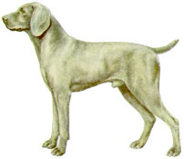{ style="float:right;"}

Selle koeratõu algupära on tänapäevani ebaselge. Teada on vaid see, et teda on puhtalt aretatud viimased sada aastat ilma ühegi teise koeratõuga ristamata. Pärit on ta Saksamaalt Weimari ja Thüringeni ümbrusest.

Tegemist on tugev ja jöulise jahikoeraga. Veimari linnukoer on tugeva jahiinstinktiga, visa, väga hea haistmisega. Meelsasti töötab vees. Turja kõrgus isastel 59 -- 70 cm, emastel 57 -- 65 cm. Värvus hõbedane või hiirehall.

### Ungari viszla
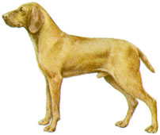{ style="float:right;"}

Ungari vizsla on üks väga vana jahikoeratõug. Pärit on ta Karpaatia mägedest. Selle koera kirjeldust ja pilte on leida juba 14 saj. pärit dokumentidest. Tõsiselt alustati aretustööga 19. sajandil. FCI tunnustas ungari vizsla tõuna 1936.

Ungari vizsla on keskmist kasvu, kerge ja kuiva kehaehitusega, elegantne linnukoer. Iseloomult on ta elav, temperamentne, kergelt allub koolitusele. Side peremehega on tugev. Koer on tugeva töötahtega. Turja kõrgus isastel 58 -- 64 cm, emastel 54 -- 60 cm. Karva värvus on kuldne.

## Urukoerad
### Taksid

Taksid on aretatud Saksamaal juba 17. saj. Nende põhiülesandeks on
töötada urus paiknevale ulukile. Taksi on võimalik kasutada ka muude ulukite jahtimisel. Need omadused on taks pärinud oma eelkäijalt, väikesekasvuliselt saksa hagijalt-brakilt.

Taks on madalakasvuline, pikaks venitunud, kuid kompaktse kehaga,
lühikeste jalgadega, reljeefse lihastikuga, tugeva luustiku ja
kehaehitusega koer. Iseloomult on ta julge, kartmatu ja tasakaalukas.
Arvestada tuleb sellega, et taksid on küllaltki isepäised ja kõrge
enesehinnanguga koerad. Takse liigitatakse karvkatte järgi lühi-, pika- ja karmikarvalisteks.

### Pikakarvaline taks
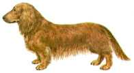{ style="float:right;"}

Pikk, pehme, läikiv, vastu keha liibuv sirge karv. Aluskarv on olemas. Karv on pikem kõril, kogu keha alapoolel, kõrvadel ja jalgade tagakülgedel. Saba alapoolel on pikk ilukarv.

### Karmikarvaline taks
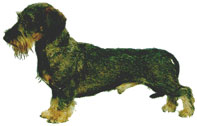{ style="float:right;"}

Kogu keha, välja arvatud koon, kulmud ja kõrvad, kaetud ühtlase tiheda, karmi, vastu keha liibuva kuni 3 cm pikkuse karvaga. Aluskarv on tihe. Koonul on harjaseline habe ja vuntsid. Samasugused karvapuhmad on ka kulmudel. Pead ja kõrvu katab
lühike karv, sabal on karv tihe, saba otsa poole lühenev. Saba alapoolel pole pikka rippuvat karva.

### Siledakarvaline taks
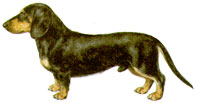{ style="float:right;"}

Karv lühike, tihe, läikiv, jäigavõitu, kuid mitte kare ja liibub vastu keha. Turjakõrgus isastel 22 -- 27 cm, emastel 20 -- 25 cm. Värvus. Ühevärviline-ruuge, kollakasruuge, üleni kollane segatud mustade karvadega. Eelistatakse puhast värvust, kusjuures hinnatum on tumeruuge. Karvakatte loetletud värvuste puhul on ninapeegel ja küüned mustad.

Kahevärviline -- must, pruun, hall roostepruunide või kollaste piiretega silmade peal, koonu külgedel, alalõual ja kõril, kõrvade sisekülgedel, rinnal, jalgade sise- ja tagakülgedel, käppadel, päraku ümber, ja jalgade alumises osas kuni 1/3 või pooleni nende pikkusest.

Mustadel ja hallidel koertel on ninapeegel ja küüned mustad, pruunidel koertel pruunid. Täpiline, marmor- või tiigerkiri. Marmorkirja koertel on põhivärvusteks ruugevõitu või hall kuni valgeni tumehallide, ruugete, pruunide või mustade ebakorrapärase kujuga täppidega. Soovitatav on, et põhivärvus ei oleks ülekaalus ja täpid ei oleks liiga suured.
Marmorkirja puhul peavad tingimata olema värvilised piirded. Ninapeegel ja küüned on mustad.

### Foksterjerid

Foksterjerid on aretatud Inglismaal. Lõplikult kujunes tõug välja 19. saj. Arvatakse, et tema esivanemateks olid Wales'ist pärit
mustad-pruunid terjerid, keda ristati teiste Inglismaal terjeritega. Karvkatte järgi eristatakse karmi- ja siledakarvalist tõuteisendit.

#### Karmikarvaline foksterjer 
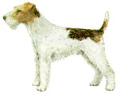{ style="float:right;"}

Liikuv, temperamentne, julge, kiirete liigutustega ja alati tõule iseloomuliku keha pingulolekuga. Ta on tugeva või kuivtugeva kehaehitusega, kusjuures ta ei tohi näida raskena ja koredana. Lihastik on hästi arenenud ja reljeefne, nahk elastne ja liibuv. Foksterjeri keha peab olema õigetes proportsioonides. Eriti tähtsad on koonu ja ajukolju pikkuste suhe ja pikkusindeks. Ideaalne on ruutjas kehakuju (pikkusindeks 100).

Turja kõrgus isastel 35 -- 40 cm, emastel 34 -- 39 cm. Karvkate on
kompaktne, tihe ja karm. Koerale ettenähtud välimuse andmiseks
kitkutakse tema karvkatet (trimmitakse) ja kohati pügatakse. 

Värvus -- üleni valge, valge mustade või kõigis toonides ruugete või punakaspruunide laikudega (kahevärviline). Valge mustade ja ruugete laikudega (kolmevärviline). Laigud võivad olla mitmesuguse kuju ning suurusega ja paikneda korrapäratult üle kogu keha, kusjuures valge värvus peab olema ülekaalus.

#### Siledakarvaline foksterjer 
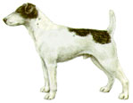{ style="float:right;"}

Samuti liikuv, temperamentne, julge, kiirete liigutustega ja alati pingul kehahoiakuga koer. Ta on tugeva ja kuiva kehaehitusega. Lihastik on hästi arenenud. Proportsioonid peavad olema õiged, keha ruutjas.

Turja kõrgus isastel 35 -- 40 cm, emastel 34 -- 39 cm. Karv on sirge, tihe ja liibuv. Aluskarva olemasolu on soovitatav. Värvus-üleni valge, kahe-või kolmevärviline, valge, tumedate või erinevas toonis ruugete või ruugepruunide laikudega või mõlemat värvi laikudega.

#### Saksa jahiterjer
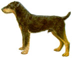{ style="float:right;"}
Saksa jahiterjer on aretatud Saksamaal pärast Esimest maailmasõda. Tõug saadi foksterjeri, uelsi terjeri ja leiklandi terjeri ristamise teel ja aretati eesmärgil saada universaalne tumedavärviline jahikoer. See eesmärk saavutatigi. Jahiterjer on ennast näidanud hea jahikoerana nii uru- kui ka muude ulukite jahil. Jahiterjerid jaotatakse karvkatte järgi kaheks tõuteisendiks -- karmi- ja siledakarvaliseks.

Jahiterjer on alati pingsa tähelepanuga, ettevaatlik, täis
otsustamisvõimet ja kartmatu. Ta on tugev, vastupidav, võõraste vastu umbusklik, sageli tige koer. Koer on tugeva kehaehitusega, pigem venitatud kui ruutjas. Turja kõrgus isastel 32 -- 40 cm, emastel 30 -- 38 cm. Põhivärvus must või tumepruun, ruugete või veelgi heledamate kollakate piiretega kulmudel, koonul, rinnal, jalgadel, käppadel ja saba alapoolel. On lubatud heledam või tumedam värvus näol ja väikesed valged täpid rinnal ja varvastel.

## Spanjelid

### Inglise cockerspanjel
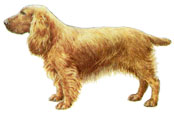{ style="float:right;"}
Aretatud on Suurbritannias. Tõustandard kinnitati 1987. Kasutatakse lindu lendu ajava koerana. Koer on rõõmsa iseloomuga ja alati liputava sabaga, mis loob tüüpiliselt toimeka liikumise, eriti jälgi ajades. Ei karda pakse tihnikuid. Õrn ja kiinduv, elurõõmus ja vallatu. Turjakõrgus isastel 39 -- 40 cm, emastel 38 -- 39 cm .Värvus on mitmesugune. Ühevärvilistel on valge lubatud ainult rinnal.

### Vene spanjel

Vene spanjel on aretatud pärast Suurt Isamaasõda Euroopas levinud
erinevate spanjelitõugude ristamise teel. Selle tulemusena on saadud küllaltki arvukas ühetüübiline põhikari, kes sarnaneb kokkerspanjeliga, kuid on viimasest suurem ja pikema kehaga. Tõu standard kinnitati 1951. a.

Vene spanjel on pikakarvaline, madalakasvuline, tugevkuiva kehaehitusega koer. Turja kõrgus on isastel 38-44cm ,emastel 36-42 cm. Tüüpiline liikumisviis on allüür, otsimisel kerge galopp. Iseloomult on koer tasakaalukas, liikuv. Värvus võib olla ühevärviline-must, pruun või ruuge, kahevärviline -- musta-, pruuni- või ruugekirju, kolmevärviline -- valge, värviliste täppide ja laikudega, must või pruun värviliste piiretega.

## Hagijad

### Eesti hagijas
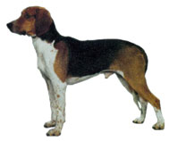{ style="float:right;"}
Eesti hagijas on aretatud kohalike hagijate keeruka vältava ristamise teel inglise madalajalgse hagijaga (beagle), inglise rebasehagijaga (foxhound), sveitsi hagijaga (Gewöhnlicher Schweizer Laufhund), lutzerni hagijaga (Luzernen laufhund) ja berni hagijaga (Dreifarbiger Berner Laufhund).

Kogu aretustööd mõjutas see, et ennesõja aegses Eestis oli keelatud jahipidamine hagijatega kelle turjakõrgus oli üle 45 cm. Tänu sõjale kinnitati eesti hagija tõustandard alles 27. dets. 1954. Eesti hagijas on alla keskmist kasvu, tugeva ja kuiva kehaehitusega. Turja kõrgus on isastel 45...52 cm, emastel 3 cm madalam. Ülekaalus on mustalaiguline kõrbpiirdega värvus (kolmevärviline). Lubatud on ka halli, punase ja kollaselaiguline ning must karvkate, kusjuures koon ja käpad on valged.

### Vene hagijas
{ style="float:right;"}
Vene hagijas on üks vanemaid jahikoeratõuge. Jahipidamist hagijatega tunti Venemaal juba XII sajandil. Algul aretasid koerakasvatajad hagijaid igaüks oma maitse järgi ja seetõttu ei olnud veel XIX saj. lõpul ühetüübilist vene hagijat. Esimene vene hagija standard koostati 1895. a.

Välimuselt meenutab vene hagijas mõningal määral hunti, seda eriti oma kõrge eeskeha tõttu ja kombe poolest hoida pead madalal. Vene hagijale on omane, erinevalt teistest koeratõugudest, kiskjalaadne välimus. Vene hagijas on üle keskmise kasvu, tugeva kehaehitusega koer. Turja kõrgus on isastel 58...68 cm, emastel 3 cm madalam. Karvkatte värvus on üleni mitmesugustes toonides kollane või on selg mustjas (sadul).

### Vene laiguline hagijas

Vene laiguline hagijas on aretatud vene hagija ristamisel inglise
rebasehagijaga (foxhound). Iseseisvaks tõuks kujunes vene laiguline hagijas XX saj. algul. Selle hagijatõu tõustandard kinnitati 1925. a.
Hiljem on standardis tehtud mõningaid korrektiive.

Vene laiguline hagijas on tugeva kehaehitusega koer. Turja kõrgus
isastel 58...68 cm, emastel 3 cm madalam. Karvkatte värvus on
mustalaiguline, kõrbpiirdega, kõht ja jalad alati valged. Lubatud on ka hallilaiguline kõrbpiirdega ja punaselaiguline värvus.

### Läti hagijas

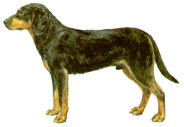{ style="float:right;"}
Läti hagijas on aretatud Lätis vana kuramaa hagija ristamisel inglise väikehagijaga (beagle), poola ja vene hagijatega keeruka vältava ristamise teel. Iseseisva tõuna kinnitati läti hagijas 1971.

Läti hagijalt nõutakse, et ta ajujahil täidaks ajaja ülesandeid s.t. läheks koos ajajatega ajusse ja leidnud uluki, jälitaks viimast kilgates kuni kütiliinini. Samuti peab ta haavatud ulukit jälitama verejälgi mööda. Läti hagijas on alla keskmist kasvu, tugevkuiva kehaehitusega.
Turja kõrgus on isastel 43...48 cm, emastel 40...46 cm. Karvkate on must, järsult eralduva kõrbpiirdega.

## Retriiverid

### Labradori retriiver

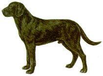{ style="float:right;"}
Aretatud Suurbritannias. Standard avaldati 1987. Lindu lendu ajav koer.

Üldmulje -- tugeva kehaehitusega, kompaktne, väga aktiivne, laia
koljuga, sügava ja avara rinna ning rinnakorviga, mahuka ja tugeva
nimmekoha ja ning tagajäsemetega.

Koer on heasüdamlik ja väga liikuv. Suurepärase haistmisega, tundliku suuga, armastab vett. Kohanev ja kiindunud seltsiline. Taibukas, innukas ja kuulekas, tugeva meeldimissooviga. Iseloomult heatahtlik, ilma agressiivsuse või kohatu arguseta.

### Kuldne retriiver
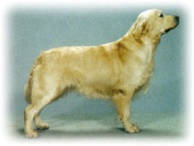{ style="float:right;"}
Aretatud on Suurbritannias. Standard avaldati 1987. Tegemist on lindu lendu ajava koeraga. 

Üldmulje -- sümmeetriline, tasakaalustatud, aktiivne, võimas, tasakaalukas liikuja, usaldusväärne, heasoovliku ilmega. Kuulekas, taibukas ja kaasasündinud töövõimega, sõbralik ja enesekindel.

Turja kõrgus isastel 56 -- 61 cm, emastel 51 -- 56 cm. Karv on sirgelt või laines langev, hea pikkusega, tiheda vettpidava aluskarvaga. Värvus mistahes kuldse või kreemika varjund, mis ei muutu mahagoniks või punaseks. Lubatud on vaid üksikud valged karvad rinnal.

---------

# Eestis jahiks kasutatavad koeratõud
## 3 - Terjerid
### Kõrgejalgsed terjerid
* borderterjer - Border Terrier
* foxterjer, siledakarvaline - Fox Terrier, Smooth
* welshi terjer - Welsh Terrier
* saksa jahiterjer - Deutscher Jagdterrier
* iiri terjer - Irish Terrier
* foxterjer, karmikarvaline - Fox Terrier, Wire
* parson russell'i terjer - Parson Russell Terrier
* madalajalgsed terrierid
* jack russell'i terjer - Jack Russell Terrier

## 4 - Taksid
* taksid (kõik 9 tõugu)
* taks, lühikarvaline - Dachshund, Kurzhaar
* taks, pikakarvaline - Dachshund, Langhaar
* taks, karmikarvaline - Dachshund, Rauhhaar
* kääbustaks, lühikarvaline - Zwergdachshund, Kurzhaar
* kääbustaks, pikakarvaline - Zwergdachshund, Langhaar
* kääbustaks, karmikarvaline - Zwergdachshund, Rauhhaar
* küülikutaks, lühikarvaline - Kaninchendachshund, Kurzhaar
* küülikutaks, pikakarvaline - Kaninchendachshund, Langhaar
* küülikutaks, karmikarvaline - Kaninchendachshund, Rauhhaar

## 5 - Spitsilaadsed ja algupärased tõud
### Põhjamaised jahikoerad
* jämtlandi koer - Jämthund
* karjala karukoer - Karjalankarhukoira
* soome püstkõrv - Suomenpystykorva
* hall norra põdrakoer - Norsk Elghund Gra
* norra lunnikoer - Norsk Lundehund
* must norra põdrakoer - Norsk Elghund Sort
* norbotteni spits - Norrbottenspets
* vene-euroopa laika  
* ida-siberi laika 
* lääne-siberi laika 
* valge rootsi põdrakoer (FCI tunnustuseta)

## 6 - Hagijad, verejäljekoerad ja sugulastõud
### Hagijad
#### Suured hagijad
* gascogne'i suur hagijas - Grand Gascon Saintongeois
* gascogne'i suur sinine hagijas - Grand bleu de Gascogne
* poitevin - Poitevin
* billy - Billy
* verekoer - Chien de Saint-Hubert
* etc

#### Keskmised hagijad
* soome hagijas - suomenajokoira
* poola hagijas - Ogar Polski
* berni hagijas - Berner Laufhund
* austria siledakarvaline hagijas - Brandlbracke (Vieräugl)
* bretooni liivakarva grifoon - Griffon Fauve de Bretagne
* tirooli hagijas - Tiroler Bracke
* serbia hagijas - Srpski Gonić
* itaalia hagijas, karmikarvaline - Segugio italiano a pelo forte
* dunker - Dunker
* hispaania hagijas - Sabueso Espaňol
* ungari (transilvaania) hagijas - Erdélyi Kopó
* slovaki hagijas - Slovenský Kopov
* harrier - Harrier
* poola hagijas – gonczy – Gonzcy Polski
* etc

#### Väikesed hagijad
* arteesia basset - Basset d'Artois
* śveitsi madalajalgsed hagijad - Schweizerische Niederlaufhunde
* vendéen'i väike basset-grifoon - Petit Basset Griffon Vendeen
* beagle - Beagle
* basset hound - Basset Hound
* saksa hagijas - Deutsche Bracke
* etc

### Verejäljekoerad
* hannoveri verekoer - Hannover'scher Schweisshund
* baieri verekoer - Bayerischer Gebirgsschweisshund
* alpi takshagijas - Alpenländische Dachsbracke –
* eesti hagijas (FCI tunnustuseta)
* vene hagijas (FCI tunnustuseta)
* vene laiguline hagijas (FCI tunnustuseta)

## 7 - Seisukoerad
### Kontinentaalsed seisukoerad
#### Kontinentaalsed linnukoerad
* ungari lühikarvaline linnukoer - Rövidszörü Magyar Vizsla
* weimari linnukoer - Weimaraner
* puudelpointer - Pudelpointer
* etc

#### Spanieli tüüpi linnukoerad
* saksa pikakarvaline linnukoer - Deutscher Langhaar
* prantsuse spanjel - Epagnuel français
* etc

#### Briti ja Iiri seisukoerad
* pointer - English Pointer
* inglise setter - English Setter
* gordoni setter - Gordon Setter
* iiri punane setter - Irish Red Setter

## 8 - Retriiverid, linde lenduajavad koerad ja veekoerad
### Retriiverid
* kuldne retriiver - Golden Retriever
* siledakarvaline retriiver - Flat Coated Retriever
* labradori retriiver - Labrador Retriever

### Linde lenduajavad koerad
* inglise kokkerspanjel - English Cocker Spaniel
* saksa spanjel - Deutscher Wachtelhund

### Veekoerad
## 10 - Hurdad
### Pikakarvalised
* vene hurt - borzoi 
* afgaani hurt - Afghan Hound

### Karmikarvalised
* iiri hundikoer - Irish Wolfhound

### Lühikarvalised
* inglise hurt - greyhound - Greyhound
