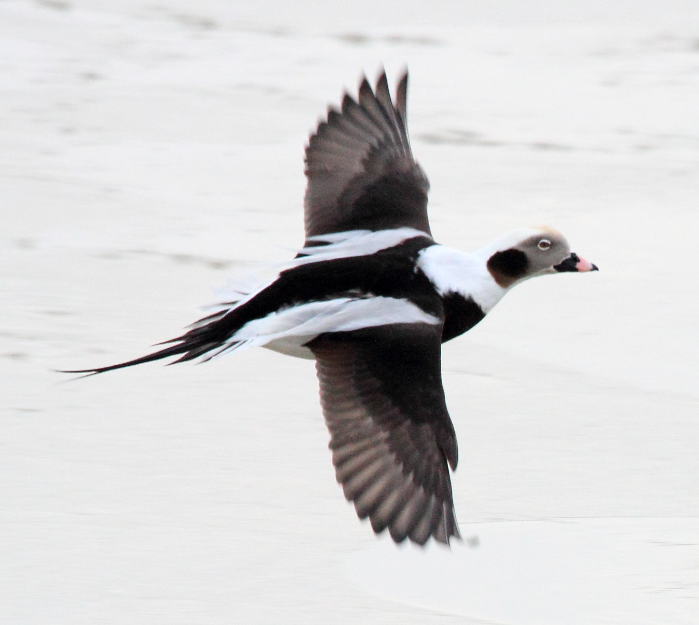

# Sissejuhatus
Parim soovitatud lindude määraja: [Euroopa ja vahemere maade lindude välimääraja](https://www.apollo.ee/linnumaaraja-euroopa-ja-vahemere-maade-lindude-valimaaraja.html). 

**Hundsulestik** - pesitsusaegne sulestik, tavaline on puhkesulestik

Tähistus:
 
- (+) on jahilind
- (-) ei ole jahilind
- (+/-) jahilind lisaklausliga (nt põllukahjustuste vältimiseks)

# Hanelised
### Pruunikashalli sulestikuga - haned
### Must-valge sulestikuga hanelised - lagled
Hallhanele, rabahanele, suur-laukhanele, kanada laglele ja valgepõsk-laglele võib pidada varitsus-, hiilimis- või peibutusjahti ning jahti jahikoeraga, välja arvatud FCI 6. rühma kuuluva jahikoeraga, 20. septembrist 30. novembrini, sealhulgas valgepõsk-laglele nende lindude tekitatud põllukahjustuste piirkonnas kahjustuste vältimise eesmärgil.

## Haned
### Suur-laukhani (+) 
Noorlinnul pole valget otsmiukulauku ja tumedad kõhulaigud (triibud) puuduvad

 
### Väike laukhani (-) 
Väga haruldane, lühem kael - kõhulaigud on väiksed, peakuju ka veidi ümaram, nokk lühem

### Rabahani (+)
Laukhanest natuke suurem, hästi tumepruun, pea hästi tume - nokk kolmevärviline - tipp must, keskelt oranzh, tüvik must, hallhanest palju tumepruunim, jalad oranzhikad
hallhanest pea kontrastselt tume, nokk väiksem, tiiva pealt tumedam

### Lühinokk-hani (-) 
Väga vähearvukas, nokk must-roosa-must, jalad roosad, kael hästi lühike (lennus prakt näha pole), kael on pikemalt pruun, selg hallhane moodi helehall

### Hallhani (+)
Jalad roosad, nokk ühevärviline, roosakas. Hanedest kõige suurem. Lendu minnes tiivapealsed hästi helehallid, paistab vahest valgegi päiksega - kõhu all mõnigaid väikseid laike. Koondub august-septembri teise-kolmanda nädalani, siis teised tundrast (lauk- ja rabahaned) asendavad

### Vööthani
Võõrliik, Euroopasse sisse toodud, kollased jalad, kollane nokk, peas kaks musta triipu

## Lagled

### Kanada lagle (+)
Võõrliik - hanedest kõige suurem (peaaegu noore luige mõõtu), pea ja kael must, põskedel valged laigud, nii kevadel kui sügisel. Lennul keha hall, tagaosa valge.

### Valgepõsk lagle (+) 
Kogu pea valge (mitte ainult põsk)- kael ja rinnaesine must, kõhualune valge - ainus selline hani 

### Mustlagle (-) 
Hästi tumeda sulestikuga (hallikaspruun), kaelal väike valge poolik võru vanalindudel.lennus kael ka must, kõht tumehall, saba valge (tiiva tagant) 

# Pardid
Võib pidada peibutus- või varitsus- või hiilimisjahti ning jahti jahikoeraga, välja arvatud FCI 6. rühma kuuluva jahikoeraga, ning arvukuse reguleerimise eesmärgil jahti kajakalistele kastlõksu või varesemõrraga 20. augustist 31. oktoobrini.

Merel, Narva veehoidlal, Võrtsjärvel, Peipsi ja Pihkva järvel 20. augustist 30. novembrini.

## Ujupardid
Ei sukeldu (pea ja kael veeall, tagumik veepeal)
Määramiseks tiiva küüdus - tiiva ülapoolel tagaserva osa, kõhualuse värvus (kas hele v tume), üldine suurus, siluett (pika kaelaga või pigem pontsakas) - ujupardid pikema kaelaga

### Viupart (Mareca penelope) (+)
Jahihooajal punakaspruuni sulestikuga, kõige arvukam läbirändel (tuhandeid) - sinikaelast natuke väiksem. keskmise pikkusega kael, sinakashall nokk. Lennus - isaslindudel tiiva peal õla juures suur valge laik (ühelgi teisel ujupardil ei ole) - häälistsebki viu, viu 

### Sinikael-part (Anas platyrhynchos) (+)
Emaspardil küüdus sinakas-lillakas, ääristatud valge triibuga 

### Rääkspart (+)
Musta tagumikuga, peene kirjaga pruunikas-hallikas - lennus väike valge tiivaaken keha ligi tiiva tagaservas (teistel pole)

### Luitsnokk part (+)
Üldine siluett - nokk suur supilusikas (nii vees kui lennus) - sügisel mõlemad pruuniksad, õlasulestik tiiva pealt sinakashall - ebaproportsionaalselt suure nokaga. sinikaelast natuke väiksem 

### Piilpart (+)
Isane kevadel rohelise "maskiga" pruun/punane pea, saba alt kollakas. Pisike part, natuke kuldnokast suurem. Kiire käänuline lend - oht on segi ajada rägapardiga

### Rägapart (+) 
Isaslinnul silma peal lai valge triip, hallikas tiiva eesserv mida piilpardil pole. Rägapardil natuke suurem nokk. Talveks aafrikasse, augusti lõpuks suurem osa läinud 

## Ujupartide lennus määramine:
### heleda kõhuga 
#### Viupart (+), Rääkspart (+)
Hele kõht, umbes sinikaela suurusega 

### väikesed pardid
#### Piilpart (+)
tiiva tagaservas hästi kitsas hele vööt, pigem ei märkagi, ainult keskmine valge ja värviline riba. Küüdus roheline.

#### Rägapart (+)
tiival 2 heledat vööti umbes sama laiad, küüdus hallikas.

### pika kaelaga 
#### Soopart (+) 
Kael keskelt hästi peenike (isaslinnul lisaks pikad sabasuled), üsna tavaline läbirändaja

## Sukelpardid

### Tuttvart (+) 
Üks tavalisemaid, isaslind suuresti must, kehaküljed valged - selg on tume, kuklas vaevumärgatav tutt. Emaslind hästi tumepruun, enamasti noka ümber valget võru pole, kui on siis hästi ähmane (eristab merivardi emaslinnust) 

### Merivart (-) 
Isaslinnu selg helehall, peakuju ümaram, suletutti pole, veidi suurem nokk kui tuttvardil

### Punapea-vart (-) 
Isasel punakaspruun pea, must rind, muidu helehall. Emasel kastanpruun pea, põsed veidi heledad. Suure mere ääres pole, madalad merelahed, järved

### Sõtkas (+) 
Välja arvatud noorlinnud - erkkollane silm (ingl k goldeneye), lennus ainuke part kellel iseloomulik tiivavihin. pea hästi suur ja ümar, kael vrdl lühike. emasel kastanpruun pea, tume nokk, muidu hallikaspruun. rabalaugastel kõige tavalisem. lennus pea tume, isaslinnul valge põselaik, pisike kompaktne part

### Väikekoskel (-) 
Natuke meenutab sõtkast emaslind, põseala on hele.

### Aul (+) 
Isane kõige klounima väljanägemisega. Avamerelind. Kaks pikka musta sabasulge, saabuvad alles oktoobris. Emaslind pruunikam, kael-pea valge, põsk tumepruun, nokk lühike tumehall, lai - sukelduvad hästi, viibivad pikka aega vee all

### Hahk (+) 
Hästi iseoomuliku geomeetrilise nokaga, must pea ülapool, alt valge, selg ja rind valge, alt must. Emane pruunikirju, "justkui pilusilm" - mõlemal hästi lai ja jõuline nokk, sinikaelpardist selgelt suuremad linnud.

### Tõmmuvaeras (-)
Tõmmuvaeral tiiva tagaservas valge aken, muidu suuresti must

### Mustvaeras (+) 
Mustvaera isa süsimust, ema tumepruun heledama pea alaosaga.

### Lauk e. vesikana (+)
Valge lauba ja nokaga süsimust (kuulub kureliste hulka) - ujudes jõnksutab pead. Lendu minnes vaja teha pikk hoovõtt, jooksevad mööda vett ja tiivad peksavad vastu vett, ohu korral tõmbavad parve hästi tihedaks kokku 

### Tait (-)
(sarnaneb veidi laugule) nokaots kollane, tüvik punane, vähearvukas lind, elab tiikidel, peidulise eluviisiga

# Haigrud ja sookurg
Haigrud tõmbavad lennus kaela kõveraks, sookurel pikalt sirge

### Hallhaigur (+), 
### Hõbehaigur(lumivalge) (-) 
### Sookurg (-)

# Kanalised
### Nurmkana e vana nime järgi põldpüü (+)
Vutilaadne, ent suurem, kodukanast väiksem. kõhuall tumepruun laik, oranzikas pea.
valdav kanaline kultuurmaastikus, rohumaadel, viljapõldudel
kevadeti paarid natuke omaette, muul ajal suurtes salkades, kurnad üle 10 muna.
Talvisel ajal meeldib lume sisse kaevata, sügava lumega lausa urgusid, magavad lume all.
Lennus kanalistel iseloomulik ühine joon - lendu lähevad valju parinaga.
Nurmkanal sabasulgede ääred roostepunakad-oranzhid

### Laanepüü (+)
põllul ei jaluta, metsalind. eriti meeldib tiheda alusrindega/võsaga mets. hääl kõrge sagedusega viiuldamine. püüvile on just tema häälega. Üsna väike, põldpüüga enamvähem samas mõõdus - kõhualune hästi dekoratiivne, valge pruuni soomusja sulestikuga, peas väike tutt, pealt hall-pruun. Jookseb palju maapinnal, lendab üle sihtide-teede. sööb puuokstel pungi,sarapuud, kased, lepad. kõige arvukam meie kanaline

### Faasan, jahifaasan (+)
pärit aasiast, ääretult pika saba ja kirju sulestik, nägu punane, kukal sinine, emastel ka pikk saba, helebeezh muidu. jalad sulistumata (meie kanalistel sulistunud)

### Teder (-)
tedre ja metsisekanad palju väiksemad kui isaslinnud.
must, suured punased kulmud.
emane hallikaspruun, tumedama nokaga,nurmkana kompaktsem, pontsakam, heledama kõhulausega
tedred hulgakesi koos puu otsas

### Metsis (-) 
enamasti männi otsas, sööb männiokkaid
shampusepudeli kork ära - pulmamängus
emane metsis - rinnaesine roostepruun, natuke suurem kui isane teder

# Nepid

### Metskurvits (nepp) (+)
kevadel mängulend, lendavad metsalagendikel, krooksuvat häält, pikk nokk allapoole suunatud. Metskurvits kõige suurem nepp (hakisuurune) hästi laiade tiibadega - ainult sügisene jaht, lehtmetsade all, kraavide ääres, sööb vihmausse, meedivad märjad kohad

### Tikutaja (ka nepiline) (+)
kuldnoka mõõtu - muda, setted, adru - roo ja vee piiril, lendu väga kiire ja käänakulise lennuga, esmalt kõrgusse. Kõhualune valge, mitte nagu Mudanepp, roosikuks kutsutakse, teeb seda wühühwühüh häält - paarituslennu heli sabasulgedega

### Mudanepp (-) 
varblase suurune, veidike suurem - läheb lendu saapa alt, ei näe ka enne, lühem nokk, seljal tugevad heledad vöödid. tikutajal mitte nii tugevad (ingl k JackSnipe)

### Rohunepp (-) (I kat kaitse) 
luhaniitudel, tikutajaga samasuur - soomuses sulestik saba alla välja, mitte nagu tikutaja valge kõht. lendu minnes läheb suhteliselt madalalt mööda taimestikku ja maandub peagi uuesti. 

# Tuvid
 
Kokku eestis 5, kaks neist pruunikad, turteltuvi, pole jahilinnud

### Kaelustuvi (alias metstuvi, meigas) (+) 
oluliselt suurem kui kodutuvi. Vanalindudel valge kaelalaik, noorel ei ole, pea hall. Lennus on tiiva peal valge laik, ühelgi teisel tuvil seda pole.

### Kodutuvi (+) 
hall (looduslik), valge, must, pruun jms

### Õõnetuvi (-) 
kodutuvist väiksem, saledam, Kaelustuvi sarnane, elab vanades musträhni õõnsustes. Lennus kodutuvil valge laik sabal, õõnetuvil ei ole. Tiiva mustad vöödid suhteliselt väiksed ja ähmased. Uhtlaselt hallikassinine, kaelal erkroheline laik. Kevadel üks esimesi kes rändelt saabub (veebruaris juba)

## Hallrästas (+) 
hästi lärmakas, kollaka pugu, valge kõhualune, hallikas pea ja kastanpruunid tiivad, parvelind.

# Vareslased (enamik jahilinnud)
### Hallvares (+)
### Ronk (-) 
### Künnivares (+) 
väiksem kui ronk, nokk sulistumata ja hele, ise süsimust. elavad kolooniatena.

### Hakk e Kaelushakk (-)
### Harakas (-) 
ainus vareslane, kellel katusega pesa

# Kajakad
Võib pidada peibutus- või varitsus- või hiilimisjahti ning jahti jahikoeraga, välja arvatud FCI 6. rühma kuuluva jahikoeraga, ning arvukuse reguleerimise eesmärgil jahti kajakalistele kastlõksu või varesemõrraga 20. augustist 31. oktoobrini.
Merel, Narva veehoidlal, Võrtsjärvel, Peipsi ja Pihkva järvel 20. augustist 30. novembrini.

## Heleda peaga
### Hõbekajakas (+) 
hallikad tiivad, valge pea ja rind. kollane silm, kurja olekuga, jäme kollane nokk, nokal punane täpp (poegade toitmiseks)

### Merikajakas (+) 
süsimust selg, valge pea ja rind, roosad jalad, nokal punane täpp (poegade toitmiseks)

### Tõmmukajakas (-) 
merikajakaga sarnane, kollased jalad, väiksem kui merikajakas, suurem kui Hõbekajakas. Põllul söömas 99% tõmmukajakas, mitte merikajakas. Mereääres mõlemad. Hallikas nokk

### Kalakajakas (+) 
hõbekajaka moodi, aga väiksem, haki suurune - tume silm. malbe olekuga

## Tumeda peaga
### Naerukajakas (+) 
tumepruun pea

### Väikekajakas (-) 
pea must ja mustad tiivaalused, tiiva tagaserv valge.