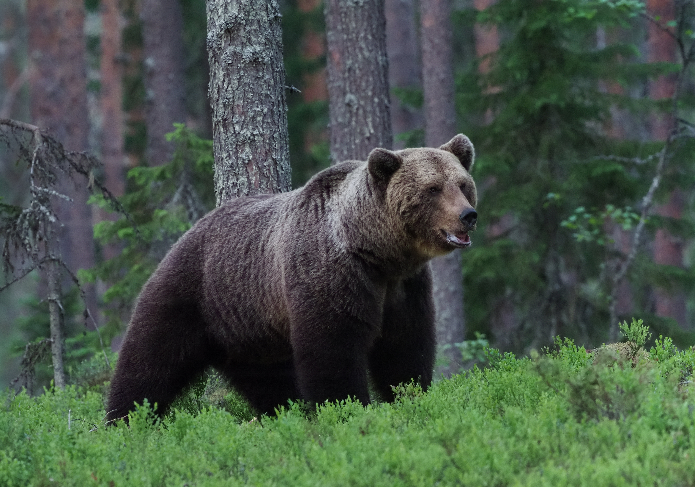
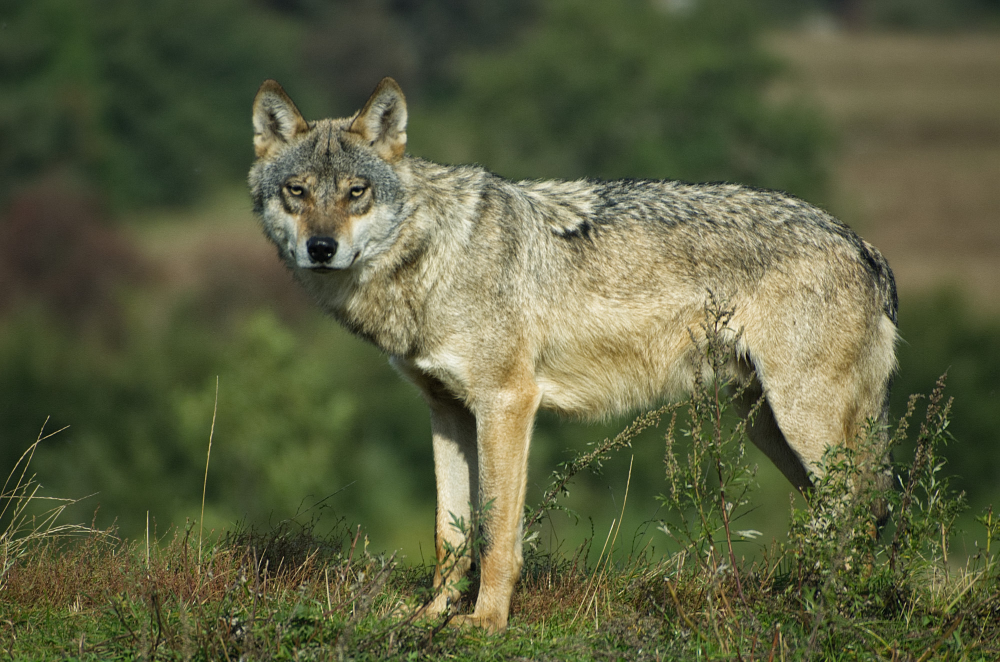
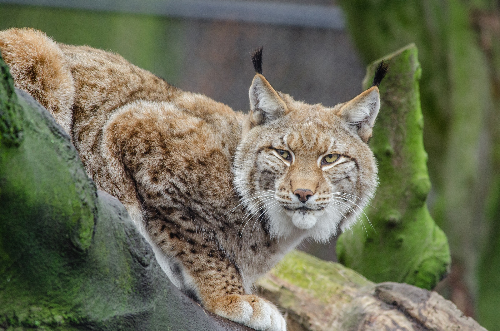
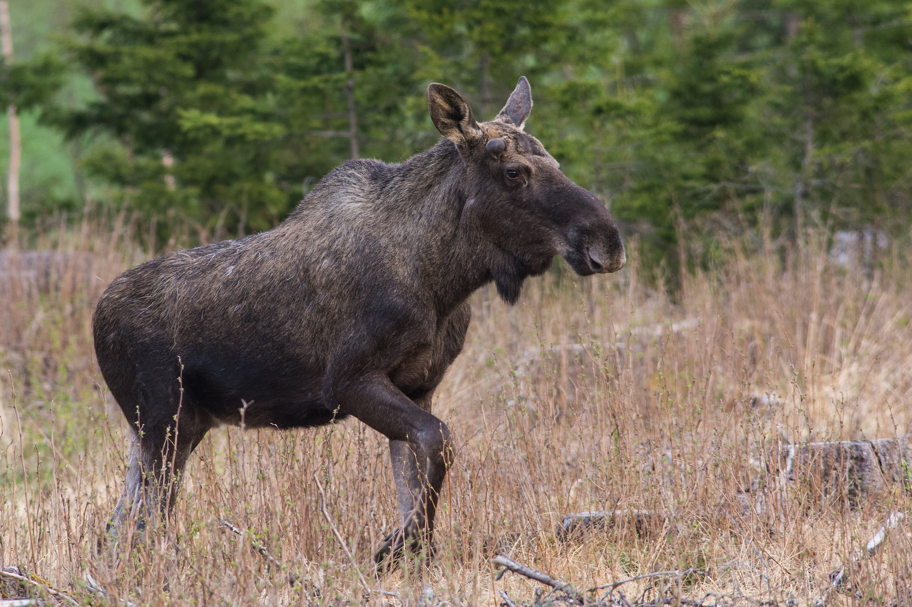
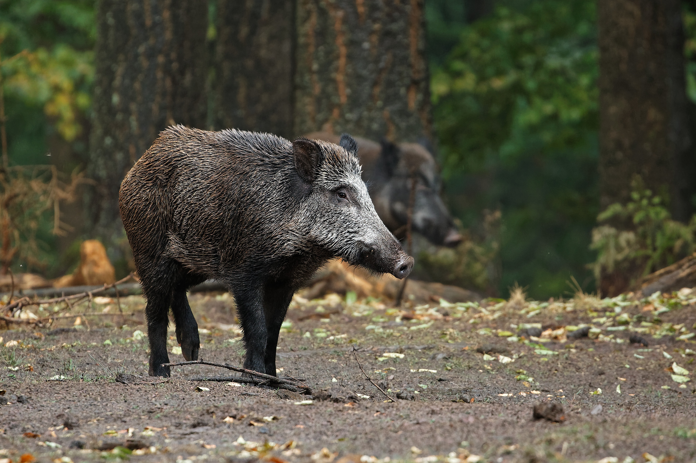
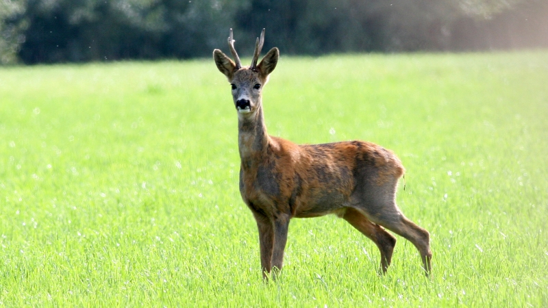
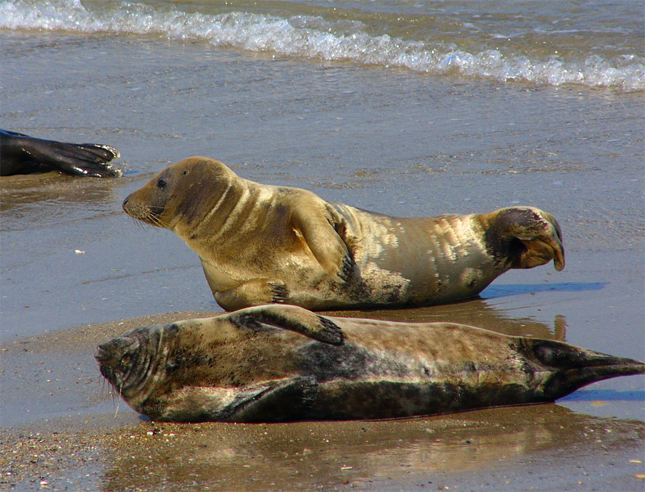

# Ulukid

Ulukiks nimetatakse metslooma, looduses vabalt elavat imetajat või lindu. Jahiulukiks nimetatakse ulukit, kelle liha, nahka või muid osi tarbitakse ning kelle jahtimine on jahieeskirjadega lubatud.

Vastavalt jahiseadusele eristatakse jahiulukite hulgas suurulukeid ja väikeulukeid ning jahilinde.

## Suurulukid

### Pruunkaru (Ursus arctos)

Eesti metsade suurim kiskja. Meil elavad karud kuuluvad keskmist mõõtu rassi, kaal 90 – 340 kg. Rekordkolju 67.46 CIC punkti (Balti rekord, maailma edetabelis 10. koht).

#### Välimus

Suur, tugev, kohmakas loom, keda katab pikk ja tihe karvastik. Eriti pikad karvad kasvavad turjal, sabajupp on karvade sees peidus. Karvastiku värvus varieerub pruunikaskollasest mustjaspruunini.

Varem arvati, et karusid on eri liiki, mis ei pea paika, sest ühe pesakonna pojad võivad olla eri värvi. Tõsi on, et vanemad karud on heledamad, valge kurgulaik esineb põhiliselt noortel.

Isakaru on märksa suurem kui emane. Eesti karude kaal jääb ilmselt 90–200 kilo vahele (maailmas kodiaki karu kaalub kuni 1000 kg). Karude kehakaal muutub aasta jooksul isegi kuni 20% taliuinaku tõttu.

Karu suuruse üle võib otsustada eeskäpa kämblapäka laiuse järgi: 5–6,5 cm sama aasta karupoeg, 8–10 – eelmisel aastal sündinud karu (1,5 a), 11-13 . täiskasvanud emaskaru, 14–17 – täiskasvanud isaskaru, 20 ja enam – väga suur isaskaru.

Eluiga ei ületa reeglina 30–35 aastat.

#### Sigimine

Jooksuaeg kestab mai keskpaigast juuni keskpaigani. Esimesel innaajal viljastamata jäänud emakarudel võib olla järeljooksuaeg. Tiinus kestab 195–225 päeva. Pojad sünnivad enamasti jaanuaris.

Vastsündinud on väga pisikesed, abitud, pimedad ja kõrvad kilega kaetud, kaal alla poole kilo. Paari nädala pärast arenevad kõrvad, kuu pärast saavad nägijateks.

Noorel emakarul 1–2, vanemal 2–3 poega, harva kuni 5. Suguküpseks saavad 3-aastaselt, poegivad esmakordselt 4–5 aastaselt, järeltulijad sünnivad üle aasta.

#### Toitumine

Karu on omnivoor. Mida põhjapool, seda suuremad kiskjakalduvused. Pärast ärkamist suundub rabale, lootes leida mulluseid jõhvikaid. Sobivaks toiduks ka korjused. Kui õnnestub, murtakse mõni suur loom, kes peidetakse risuhunniku alla laagerdamiseks.

Näljane karu lammutab sipelgapesi ja kände, mesitarusid. Varasuvel toitub puulehtedest- ja võrsetest, lopsakatest taimedest. Marju süüakse suurtes kogustes, külastatakse ka kaerapõlde.

Aastal 2008 kütiti 37, 2009. a 45, 2010. a 57

Allikas: Tiit Randveer. Jahiraamat. 2003

#### Jahipidamine

Karu on jahiuluk, tema küttimise korraldamiseks teeb Jahindusnõukogu ettepanekud Keskkonnaametile kes kehtestab igal aastal küttimismahu.

Karu võib tulistada ainult kuuliga, vintraudse püssi korral peab kaliiber olema vähemalt 6,5mm ja kuuli kaal vähemalt 9 grammi.

Karule, välja arvatud poegadega emakarule, võib pidada varitsus- või hiilimisjahti **1. augustist 31. oktoobrini** karu tekitatud kahjustuste piirkonnas kahjustuste vältimise eesmärgil.

-------

### Hunt (Canis lupus)

Eesti metsade kõige kardetum kiskja. Suurim kütitud hunt kaalus 82 kg.

#### Välimus

Väga sarnane suure hundikoeraga. Hundil on koeraga võrreldes massiivsem rind ja kael ning tugevamad jalad. Hundi suur pea on pisut ettepoole suunatud kolmnurksete kõrvadega. Saba hoiab hunt seljaga ühel joonel või langetatuna, kusjuures saba tipp võib olla tõstetud. Pead hoiab ta rahulikus olekus seljaga enam-vähem ühel joonel.

Hunti iseloomustab rahulik sörk, kus keha raskuskese ühel kõrgusel püsib. Koera jooks on teistsugune – mitte nii ökonoomne kui hundil.

Huntide kehakaal jääb enamasti vahemikku 35–45 kg, suur isaloom võib kaaluda isegi kuni 80 kg. Tüvepikkus on 110–116 cm.

Hundi jälgi on võrdlemisi raske koera omast eristada. Hundi jälg on pikergusem, koeral ümaram. Vana jahimehetarkuse kohaselt võib hundijälje keskmiste ja välimiste varvaste jäljendite vahele asetada tiku, ilma et see neid puutuks, koerajäljel lõikab tikk keskmiste varvaste jäljendite alaosa.

#### Emas- ja isasloom

Jälje pikkuse ja laiuse suhe isashundil 1,3 ja emashundil 1,5. Uriinilaik paikneb isasloomal jäljerea kürval, emasloomal aga jäljereal.

#### Sigimine

Hunt on monogaamne loom, paarid püsivad ühe paarilise surmani, väga väikese asustustiheduse korral esineb ka polüseemiat. Jooksuaeg Eestis on jaanuari lõpul-veebruaris. Karjas valitseb nii kõva kord, et võimuastmestikus madalamal olevad dominantse isasega reeglina kaklust ei alusta.

Tiinus vältab 62–75 päeva, pojad sünnivad enamasti aprillis, paikseks jääb kari juba märtsis, pesapaik valitakse veekogu lähedusse (mitte kaugemal kui 0,5 km). Pesaks valitakse tuulemurd, kuuseokstealune, vahel ka mägra- või rebaseurg seda suurendades. Vahel rajavad ise uru, uruava läbimõõt 60–70 cm.

Pesakonnas keskmiselt 4–7 (kuni 15) kutsikat, kelle ellujäämine sõltub toiduküllusest. Emasloom ei lahku kolme nädala jooksul pesast, isasloom toob toidu. Nägijaks saavad kutsikad 9–12 päevaselt. Emased saavutavad suguküpsuse teisel, isasel kolmandal eluaastal.

#### Toitumine

Tähtsaim toiduobjekt sõralised. Tähtsuselt teisel kohal jänesed, ka kobras kõlbab söögiks. Pisinärilised on ka oluline toiduallikas (eriti hiired kevadel).

Kiskjalistest toitub põhiliselt rebasest ja kährikust, kärplastele kõlbavad ka. Vahel satuvad söögiks ka karu, ilves, kalad ja linnud. Esineb ka kannibalismi.

Aastal 2008 kütiti 156, 2009. a 103, 2010. a 130

Allikas: Tiit Randveer. Jahiraamat. 2003

#### Jahipidamine

Hunt on jahiuluk, tema küttimise korraldamiseks teeb Jahindusnõukogu ettepanekud Keskkonnaametile kes kehtestab igal aastal küttimismahu.

Hundile võib pidada peibutus- või varitsus- või hiilimis- või ajujahti ning jahti piirdelippe ja jahikoera kasutades **1. novembrist jahiaasta lõpuni**.

---------------

### Ilves (Felis lynx)

Eestis ainus paikselt looduses elav kaslane. Kaalub keskmiselt 20 – 25 kg. Erinevate teadlaste andmetel sööb aastas 40-80 metskitse. Rekordkolju 28.99 CIC punkti (maailma edetabelis 2. koht) rekordnahk 214.84 CIC punkti-maailmarekord.

#### Välimus

Suur kass, värvus varieerub kollakashallist roostepunaseni. Pea, selg, küljed ja jalgade välisküljed on kõigil tumedamad ja üldisest värvusest eristuvate tumedamate tähnidega. Iseloomulikud tunnused on u 5 cm pikkused karvatutid kõrvade tipus ja “põskhabe”, mille suurust arvestatakse trofeenahkade hindamisel.

Küünised on sissetõmmatavad nagu kassil. Eesti ilvese tüvepikkus varieerub vahemikus 80–115 cm, sabapikkus 15–20 cm, õlakõrgus 65–75 cm. Kehakaal 10–20 kg, vanadel isasloomadel kuni 32 kg-ni.

#### Sigimine

Jooksuaeg veebruaris märtsis. Üht emaslooma võib jälitada kuni 5 isast. Emasloom on paaritumisvalmis 3 päeva, tiinus kestab 63–74 päeva. Järeltulijaid on 1–6, enamasti 2–3, sünnivad tavaliselt mais, kaaludes u 300 g, 12 päevaselt saavad nägijaks. Kaks kuud toituvad emapiimast, pojad jäävad esimese eluaasta lõpuni ema juurde. Suguküpseks saavad kaheaastaselt.

#### Toitumine

Ilves sööb vaid lihatoitu, põhilisteks saakloomadeks on valgejänes, metskits, rebased, kährikud, närilised ja kanalised. Ilves peab varitsusjahti. Hiilib kümnekonna meetri kauguselt teeb paar hüpet, mittetabamise korral saaki edasi ei jälitada.

Päevane toiduvajadus on 1–1,5 kg, seega peaks ühest metskitsest paariks nädalaks jätkuma, aga ilves üle paari korra saagi juurde tagasi ei pöördu ja ei söö lehkama läinud liha. Võib ühe ööga mitu metskitse murda.

2008 kütiti 150, 2009 184, 2010 181 ilvest

Allikas: Tiit Randveer. Jahiraamat. 2003

#### Jahipidamine

Ilves on jahiuluk, tema küttimise korraldamiseks teeb Jahindusnõukogu ettepanekud Keskkonnaametile kes kehtestab igal aastal küttimismahu.

Ilvesele, välja arvatud kutsikatega emailvesele, võib pidada peibutus- või varitsus- või hiilimis- või ajujahti ning jahti jahikoeraga **1. detsembrist jahiaasta lõpuni**.

--------------

### Põder (Alces alces)

Läbi aegade hinnatuim jahiuluk Eestis. Meie metsade suurim loom. Kütitud on enam kui pool tonni kaalunud põdrapulle. 

#### Välimus

Põder on suurim hirvlane. Täiskasvanud looma tüvepikkus on 230–290 cm, sabapikkus 4–5 cm, õlakõrgus 180–190 cm. Täiskasvanud emasloomade (lehmade) kaal jääb enamasti 250–350 kg vahele, isasloomad (pullid) kaaluvad 300–500, haruharva isegi 600 kg. Mullikad (1,5 a) kaaluvad 200-300 kg, vasikad sügisel u 100 kg.

Põtradel on “habe”, mis on lõua all rippuv pikkade karvadega kaetud nahavolt, mis pullidel võib olla kuni poole meetri pikkune.

Pulle iseloomustavad sarved, mis esmakordselt ilmuvad pullvasikatel esimese eluaasta lõpul, mullikatel on 1–2-harulised, 2–3-aastastel 2–3-harulised jne. Võimsamaid sarvi kannab pull reeglina 5–10 aasta vanusena, siis muutuvad need taas väiksemaks. Kuju järgi eristatakse pulk- ja kühvelsarvi, mis on geneetiliselt määratud. Vanemad pullid heidavad sarved maha tavaliselt novembris, olles seega jahihooaja lõpul sarvetud.

Eristada saab lehmast sellega, et pullil on võimsam habe, tugevam keha, selg sirgem ja isasloomal ulatub jalgade valge värvus reite alaosani, emasloomal sabajuureni. Pullide ligikaudset vanust määratakse üldjuhul sarvede järgi, täpsemalt saab määrata hammaste kulumise järgi.

#### Sigimine

Jooksuaeg algab augusti lõpul ja lõpeb oktoobris. Alates augustist hakkavad pullid häälitsema, et teada anda oma asukoht – lehmadele kutse, teistele pullidele ähvardus. Üks pull võib viljastada kuni 7 lehma.

Tiinus kestab 227–235 päeva, vasikad sünnivad aprilli lõpust juuni alguseni. Vasikaid on noorematel lehmadel üks, vanematel 2, harva 3–4. Järglased saavad suguküpseks juba vasikaeas.

#### Toitumine

Põder on dendrofaag, sööb puude ja põõsaste võrseid, lehti, okkaid ja koort. Suvel sööb ka rohttaimi, sealhulgas veetaimi, mis meelitavad kõrge naatriumisisaldusega. Suvine keskmine päevane toidukogus täiskasvanud põdral on kuni 30 kg, mullikal 15, suve lõpul 2–3 kg.

Suvel eelistab kaske, pihlaka, paakspuu ning rohttaimede (põdrakanep) võrseid koos lehtedega, sügisel ja kevadel ka puukoor. Talvel sööb eelistatult haava, paju, pihlaka puuvõrseid. Oluline on ka mänd.

Aastal 2008 kütiti 4133, 2009. a 4031, 2010. a 4255 põtra.

Allikas: Tiit Randveer. Jahiraamat. 2003

#### Jahipidamine

Põdrale võib jahti pidada:

* 15\. septembrist 15. detsembrini 
  * **pullile** varitsus- või hiilimis- või peibutusjahti

* 1\. oktoobrist 15. detsembrini 
  * ajujahti ja jahti jahikoeraga1
  
  * **lehmale** ja **vasikale** varitsus- või hiilimis- või peibutus- või ajujahti.

1 - välja arvatud FCI 6. rühma kuuluva jahikoeraga, kelle tõustandardis kinnitatud maksimaalne turjakõrgus on üle 52 cm

---------

### Punahirv (Cervus elaphus)

Punahirve sarvekrooni seinale ihkab endale vist iga Eesti jahimees. Hirv on levinud peamiselt Hiiu- ja Saaremaal. 

#### Välimus

Hirv on välimuse poolest kuninglik loom. Suuruselt metskitse ja põdra vahepealne. Hirvede kehasuuruses väljendub sooline dimorfism. Pullid kaaluvad 160–200 kg, harva kuni 300, lehmad sadakond kilo. Tüvepikkus on kuni 230 cm, õlakõrgus 120–150 cm.

Isaslooma ehivad sarved, mis heidetakse enamasti märtsis. Esimesed sarved hakkavad kasvama alles teise eluaasta alguses ja need puhastatakse augustis-septembris. Valmis sarved kaaluvad enamasti 2–5, üliharva kuni 20 kg. Normaalselt on täiskasvanud pullil ühel sarvel 5 või enam haru.

Eluiga ulatub kuni 20 eluaastani. Hammaste kulumise järgi määratakse vanus. Hirvepulli välimus muutub elu jooksul üsna oluliselt. Isaslooma jälg on 11×8 cm, emastel ja noortel väiksem.

#### Sigimine

Jooksuaeg on septembris ja oktoobri alguses. End suvel nuumanud pullid kaotavad ettevaatlikkuse. Välimus muutub: sarved on kasvanud ja nahast puhastunud, kael muutub jämedamaks ja ilmub tumedamatest karvadest lakk, lõhnanäärmed aktiviseeruvad. Pullidel on võimas möire.

Tugevad pullid koondavad enda ümber haaremi ja viljastavad kõik valmisolevad emasloomad. Võrdväärsete pullide vahel toimub võitlus, mis võib surmaga lõppeda. Pullid ei söö jooksuajal ja kaotavad kuni veerandi kehakaalust. Tiinus kestab 8 kuud (230–240 päeva). Vasikad (1–2) sünnivad mai lõpul ja juuni alguses.

#### Toitumine

Põhilise osa toidust moodustavad rohu- ja puhmarinde taimed. Hirv hangib toitu ka mulla seest, näiteks kartulimugulaid; sööb meelsasti puuvõrseid ja -koort. Kohati koorib saart ja kuuske.

Aastal 2008 kütiti 300, 2009. a 403, 2010. a 497

Allikas: Tiit Randveer. Jahiraamat. 2003

#### Jahipidamine

Punahirvele võib jahti pidada:

* 15\. augustist 15. veebruarini, sealhulgas:  
  * 1\. septembrist 15. veebruarini pullile varitsus- või hiilimis- või peibutusjahti 
  
  * 1\. oktoobrist 15. veebruarini ajujahti ja jahti jahikoeraga1
  
  * 15\. augustist 31. jaanuarini lehmale ja vasikale varitsus- või hiilimis- või peibutusjahti 
  
  * 1\. oktoobrist 31. jaanuarini ajujahti ja jahti jahikoeraga1
  
  1 - välja arvatud FCI 6. rühma kuuluva jahikoeraga, kelle tõustandardis kinnitatud maksimaalne turjakõrgus on üle 52 cm

-------------------

### Metssiga (Sus scrofa)

Metssiga jõudis Eestisse 20. sajandi 20nendatel aastatel. Praegusel ajal levinud kõikjal üle riigi. Meil kütitud metssigade kaal on tavaliselt 50 – 150 kg. Suurim kütitud kult kaalus 350 kg, emis 300 kg. 

#### Välimus

Välimuselt täiesti tume. Isasloomad on emasloomadest tunduvalt suuremad, nende kaal jääb enamasti vahemikku 100–150 kg, harva kuni 300 kg-ni, emiste(emasloom) kaal on keskmiselt 80–199 kg. Põrsad kaaluvad sügisel 20–30 kilo, kesikud (aastased) u 40 kilo.

Kuldil on suured kihvad, enamasti kasutab ta kihvu jooksuajal rivaali haavamiseks. Kaitseks teise kuldi kihvade eest areneb isasloomadel sügiskuudel rindkeret ümbritsev võimas sidekoeline kilp, millest isegi püssikuul läbi ei lähe.

Metsseale tähtis “tööriist” on kärss, mille abil suudab ta isegi külmunud maast toitu hankida. Metssigade soo ja vanuse eristamine on väga raske, nad on kõik ühtmoodi tumedad (v.a põrsad 4–5 esimest elukuud), olulised eristamistunnused on väiksemad kehamõõtmed ja pruunikas värvus.

Kultidel on võimsam kehaehitus kui emistel, nähtavad on ka kihvad ja kõhu alt paistab “pintsel”.

#### Sigimine

Jooksuaeg on ajavahemikus novembrist jaanuarini ja kestab ühes piirkonnas 1–1,5 kuud. Emis võib innelda kaks korda aastas (kui esimene pesakond hukkub), teine paaritumine toimub ükskõik millal.

Isasloomad saavad suguküpseks 1,5 aastaselt, aga aetakse juba varem igaks juhuks karja juurest eemale, et vältida sisearetust (inbriiding). Kuldid, kes muidu üksikult elutsevad, ühinevad jooksuajal karjaga, kus toimuvad vihased võitlused, kus nõrgemad eemale aetakse. Võitja viljastab kõik karja emised.

Tiinus vältab 18–20 nädalat, s.o 4–5 kuud. Põrsad sünnivad märtsist maini, põhiliselt aprillis. Emisel on keskmiselt 5–8, harva kuni 12 põrsast. Emisel on 5 paari nisasid, esimeses paaris on piima palju rohkem kui viimastes.

#### Toitumine

Metssead on omnivoorid e kõigesööjad. Ööpäevane toidukogus on kuni 6 kg. Võib eristada toidutüüpe – taimede maapealsed osad; taimede maa-alused osad; viljad, marjad, seemned – tammetõrud, meelistoiduks on põllukultuurid kartul, hernes, mais, rukis, kaer; loomne toit – tõugud, pisiimetajad, raiped, linnumunad. Metssead saavad 2/3 toidust maad sonkides.

2008 kütiti 19 757, 2009 20 072 ja 2010 17 028 metssiga

Allikas: Tiit Randveer. Jahiraamat. 2003

#### Jahipidamine

Metsseale võib pidada:  

* aasta ringi varitsus- või hiilimis- või ajujahti;  
* 1\. oktoobrist 31. märtsini jahti jahikoeraga, välja arvatud FCI 6. rühma kuuluva jahikoeraga, kelle tõustandardis kinnitatud maksimaalne turjakõrgus on üle 52 cm;  
* jahti püünisaeda kasutades Keskkonnaameti määratud juhtudel.

-------------

### Metskits (Capreolus capreolus)

Eestis kõige arvukam sõraline. Metskitsede arvukus on praegu heas seisus. Siinsete isendite keskmine kehakaal on 25-30 kg. 

#### Välimus

Sale kiiljas kehakuju viitab kohastumusele eluks tihedas alusmetsas ja kõrges rohus. Sügisel täiskasvanute kehakaal 28–29 kg, talledel 18–22, mis talvel langeb. Õlakõrgus 70–80 cm, tüvepikkus 110–130 cm. Talvekarvas loomal torkab silma valge tagumik nn sabapeegel, millega hoiatatakse teisi.

#### Sigimine

Jooksuaeg on juuli teisel ja augusti esimesel poolel. Kitsede valmisolek viljastamiseks kestab 3–4 päeva. Kitsedel aktiveeruvad südasuvel jälgedesse lõhnavat sekreeti eristavad digitaalnäärmed, mis paiknevad tagajala sõrgade vahel. Kui sokk leiab sobiva kitse, algab tunde või isegi terve päev kestev tagaajamine. Lõpuks joostakse ringikujuliselt – mahasõtkutud rohtu jäävad nn nõiaringid.

Kandeaeg on 276–295 päeva. Kitsedel on pikk kandeaeg, et talled sünniksid soodsal aastaajal, sellepärast ei hakka munarakk kohe pärast viljastumist arenema (latentne periood). Põhiosa talledest sünnib mais-juunis. Järeltulijaid enamasti 2, vahel 1, harva 3.

Sündinuist hukkub esimestel elukuudel 30–40%, mis on tingitud ebasoodsast ilmastikust, niidukitest, vaenlastest (rebane, hulkuvad koerad ja kassid).

#### Toitumine

Metskitse magu on väike, moodustades kehakaalust vaid 6,4–7,5% (hirvedel 11,5%, põtradel 10,6–13,1%). Metskitsed söövad vaid kõrge toiteväärtusega taimeosi – pungi, seemneid, vilju, noori puuvõrseid ja -lehti, risoome. Kui söödud toit ei suuda rahuldada energiavajadust, tekib nn nälgimine täis maoga.

Talvel, kui toidu madalale kvaliteedile lisandub veepuudus, aeglustub peristaltika ja loom ei saa seedekulgla blokeerituse tõttu rohkem süüa. Talvel sööb täiskasvanu 1,3–1,6 kg, tall 1 kg päevas, suvel täiskasvanu 7,3–7,5 kg toitu.

Suvises toidus on esikohal rohttaimed, lehtpuuvõrsed ja lehed; talvel eelistab pohla- ja mustikavõrseid, kui lumikate seda ei võimalda, siis süüakse lehtpuuvõrseid. Söödasõimedesse pandud heina vastu tekib huvi siis, kui muud enam süüa ei ole. Okaspuude võrsed ja okkad muutuvad põhitoiduks kurnatud metskitsedel.

2008 kütiti 18 006, 2009 15 716, 2010 5075 metskitse

Allikas: Tiit Randveer. Jahiraamat. 2003

#### Jahipidamine

Metskitsele võib jahti pidada 1. juunist 31. jaanuarini, sealhulgas:

* sokule
  
  * 1\. juunist 31. jaanuarini varitsus- või hiilimis- või peibutusjahti 

* kitsele või tallele 
  
  * 1\. septembrist 31. jaanuarini varitsus- või hiilimisjahti  

* 1\. oktoobrist 31. jaanuarini ajujahti ja jahti jahikoeraga1
  
  1 - FCI 3. ja 4. rühma kuuluv

---------

### Hallhüljes (Halichoerus grypus)

#### Jahipidamine

Hallhülge küttimisel võib kasutada ainult kuuli ja vintraudse püssiga peab vintraua kaliiber olema vähemalt 6,5 millimeetrit ning padrunis kasutatava kuuli kaal vähemalt 9,0 grammi.

Varitsus- või hiilimisjahti võib pidada **15. aprillist kuni 31. detsembrini.**

------------------------

## Väikeulukid

### Rebane (Vulpes vulpes)

Rebane on levinud kogu Eesti mandrialal ja saartel, esineb ka väikestel laidudel ja saarekestel nii ajutiselt kui ka alaliselt. Rootsi teadlaste uurimistulemused näitavad, et liiga kõrge rebase arvukuse puhul on nad kohati võimelised hävitama 100% metskitse juurdekasvust. Rebane on marutaudi levitaja.

#### Jahipidamine

* 1\. augustist 31. märtsini peibutus- või varitsus- või hiilimisjaht ning jaht kastlõksuga  
* 1\. oktoobrist jahiaasta lõpuni uru- või ajujaht ning jaht jahikoeraga või piirdelippe kasutades 

-----------

### Šaakal, (Canis aureus)

#### Jahipidamine

* 1\. septembrist jahiaasta lõpuni peibutus- või varitsus- või hiilimis- või ajujaht ning jaht piirdelippe kasutades 
* 1\. oktoobrist jahiaasta lõpuni jaht jahikoeraga 

----

### Kährik (Nyctereutes procyonoides)

Eestis võõrliik. Esimesed kährikud lasti meil lahti 1950. aastal suure, üle Nõukogude Liidu toimunud, kampaania käigus. Praeguseks ulatub kähriku levila Euroopas Prantsusmaani. Kährik on halastamatu murdja, kes hävitab oma lähikonnas kõik, kellest jõud üle käib. Samuti levitab ta marutaudi. Kuna on tegemist võõrliigiga, tuleks tema arvukus meil nullilähedaseks viia.

#### Jahipidamine

* aasta ringi peibutus- või varitsus- või hiilimisjaht ning jaht kastlõksuga
* 1\. oktoobrist jahiaasta lõpuni uru- või ajujaht ning jaht jahikoeraga või piirdelippe kasutades 

----

### Mink (Mustela vison)

Eestis võõrliik. Populatsioon tekkis karusloomafarmidest metsa põgenenud isenditest. Tänu ristumisele kohaliku – euroopa naaritsaga on euroopa naarits meil välja surnud. Kuna tegemist on võõrliigiga ja kuna ta murrab rohkem, kui ta ära jõuab süüa, tuleks tema arvukus viia nullilähedale

#### Jahipidamine

* aasta ringi varitsus- või hiilimisjaht või jaht kastlõksuga
* 1\. oktoobrist jahiaasta lõpuni jaht jahikoeraga 

----

### Tuhkur (Mustela putorius)

Tuhkur on väga laialt levinud väikekiskja. Tegutseb enamasti kultuurmaastikul ja veekogude kaldaalal. Kipub teinekord rüüstama kanalaid. Näriliste hävitajana on ta kahtlemata looduskeskonnas kasulik uluk.

#### Jahipidamine

* 1\. oktoobrist 31. märtsini jaht püünisrauaga puult või ehitisest, jaht kastlõksuga, varitsus- või hiilimisjaht
* 1\. oktoobrist jahiaasta lõpuni jaht jahikoeraga 

---

### Metsnugis (Martes martes)

Metsnugis kui väärtusliku karusnahaga liik on olnud hinnaline jahiobjekt juba ammustest aegadest peale. Meil on nugis levinud üle kogu vabariigi. Kuna tema toiduratsiooni kuuluvad ka valgejänes, teder, laanepüü ja metsis on nugise mõju liiga suure arvukuse puhul nendele liikidele tuntav. 

#### Paljunemine
Loote arengus esineb latentsusperiood.

#### Jahipidamine

* 1\. oktoobrist 31. märtsini jaht püünisrauaga puult või ehitisest, jaht kastlõksuga, varitsus- või hiilimisjaht
* 1\. oktoobrist jahiaasta lõpuni jaht jahikoeraga 

---

### Kivinugis (Martes foina)

#### Jahipidamine

* 1\. oktoobrist 31. märtsini jaht püünisrauaga puult või ehitisest, jaht kastlõksuga, varitsus- või hiilimisjaht
* 1\. oktoobrist jahiaasta lõpuni jaht jahikoeraga 

---

### Mäger (Meles meles)

Mäger on levinud Eesti mandrialal kõikjal, kus on tingimused urgude ehitamiseks. Samuti viidi ta 1960. aastal Saaremaale. Mäger on meie uruelanikest-imetajatest ainuke, kes on urgudega seotud aastaringselt.

#### Piirangud

Urujaht keelatud 10 või rohkema urusuudmega urusüsteemi alal. Jahipidamisel lahti kaevatud urud tuleb jahi lõppedes kinni ajada.

#### Jahipidamine

* 1\. septembrist jahiaasta lõpuni varitsus- või hiilimisjaht või jaht kastlõksuga 
* 1\. oktoobrist jahiaasta lõpuni uru- või ajujaht ning jaht jahikoeraga 

---

### Kobras (Castor fiber)

Kobras on üks suuremaid närilisi. Tegemist on põlisasukaga, kes üleküttimise tagajärjel meil kadus. Uuesti istutati koprad Eestisse 1957. aastal. Praeguseks on kobras levinud üle riigi isegi saartele, arvukus on suur. Praegu tekitab kobras üle-Eesti metsadele, põldudele märkimisväärset kahju.

#### Piirangud

Hiilimis- või varitsus-koprajahil vibuga peab nool olema kinnitatud vibu külge nööriga

#### Jahipidamine

* 1\. augustist 15. märtsini jaht mõrraga, piirdevõrguga, püünisrauaga või FCI 3. ja 4. rühma kuuluva jahikoeraga 
* 1\. oktoobrist jahiaasta lõpuni jaht jahikoeraga
* 1\. augustist 15. aprillini varitsus- või hiilimisjaht või kopra välja püük FCI 3. ja 4. rühma kuuluva jahikoeraga 
* aasta ringi kopra tekitatud kahjustuste korral varitsus- või hiilimisjahina või koprapüügina FCI 3. ja 4. rühma kuuluva jahikoeraga Keskkonnaameti loal.

---

### Ondatra (Ondatra zibethicus)

Eestis võõrliik. Meile istutati ondatra 1947. Seitsmekümnendatel ulatus nende arvukus kuni 50 000 isendini. Tänaseks on ta ilmselt tänu mingile Eestist praktiliselt kadunud.

#### Jahipidamine

* 1\. oktoobrist jahiaasta lõpuni jaht mõrraga, piirdevõrguga või varitsus- või hiilimisjaht.

---

### Halljänes (Lepus europaeus)

Halljänes on kultuurmaastike loom. Sügavas metsas halljänes ei elune. Peamiseks vaenlaseks on rebane.

#### Jahipidamine

* 1\. oktoobrist jahiaasta lõpuni jaht FCI 3., 4., 6. ja 10. rühma kuuluva jahikoeraga.

---

### Valgejänes (Lepus timidus)

Eestis laialt levinud jäneseliik. Elab peamiselt metsas ja soos. Kohati tänu ilveste rohkusele on valgejänese arvukus langenud väga madadalale.

#### Jahipidamine

* 1\. oktoobrist jahiaasta lõpuni jaht FCI 3., 4., 6. ja 10. rühma kuuluva jahikoeraga.

---
